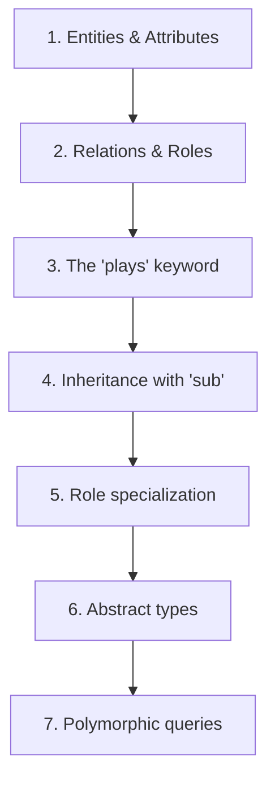

# Teaching Approach 4: PERA Modeling

## Philosophy

**"Think in types, model in concepts, query polymorphically"**

The PERA (Polymorphic Entity-Relation-Attribute) approach teaches TypeDB by starting from its unique data model where the conceptual model *is* the logical model. Unlike traditional databases that require translation between conceptual (ER diagrams) and logical models (tables, documents, nodes), TypeDB's PERA model lets learners model their domain once, at the highest abstraction level.

This approach emphasizes that everything in TypeDB has a type, and therefore everything can be a variable—the foundation of TypeDB's polymorphic query capabilities.

---

## PERA Concept Breakdown

### The Four Pillars

| Component | Purpose | Key Insight |
|-----------|---------|-------------|
| **Entities** | Independent objects | Exist without reference to other types (a `person` exists regardless of friendships) |
| **Relations** | Dependent objects | Cannot exist without their role players (an `employment` needs an employer and employee) |
| **Attributes** | Values dependent on objects | Properties with literal values (strings, numbers, etc.) identified by their value |
| **Plays/Roles** | Interface polymorphism | How types participate in relations—the "glue" that connects the model |

### The "Plays" Concept: The Heart of PERA

The `plays` keyword is what makes TypeDB fundamentally different from property graphs and ER models:

```typeql
define
relation employment,
    relates employer,
    relates employee;

entity person,
    plays employment:employee;
    
entity company,
    plays employment:employer;
```

**Key teaching points:**
1. **Roles are interfaces** — Think of `employer` as an interface that types can implement
2. **Scoped role names** — `employment:employer` is the full role identifier (allows reuse across relations)
3. **Multiple implementations** — Multiple types can play the same role (interface polymorphism)
4. **Inheritance** — Subtypes inherit their parent's `plays` declarations

### Objects vs Values

| Entity/Relation Types | Attribute Types |
|----------------------|-----------------|
| Contain **objects** | Contain **values** |
| Freely instantiable | Identified by value |
| Two identical objects ≠ same object | Two attributes with same value = same attribute |
| Can implement interfaces | Cannot play roles or own attributes |

---

## Schema Design Progression

### Level 1: Basic Types (Hour 1)

Start with the simplest complete model:

```typeql
define
entity user;
attribute username, value string;
user owns username;
```

**Learning objectives:**
- Entity types represent independent things
- Attribute types hold values
- `owns` connects entities to their properties

### Level 2: Relations and Roles (Hour 2)

Introduce dependencies between objects:

```typeql
define
relation friendship,
    relates friend @card(2);
    
user plays friendship:friend;
```

**Learning objectives:**
- Relations depend on role players
- `relates` defines a role interface
- `plays` implements that interface
- Cardinality constraints (`@card`) control how many players

### Level 3: Rich Relations (Hour 3)

Relations can own attributes and play roles themselves:

```typeql
define
relation employment,
    relates employer,
    relates employee,
    owns start-date,
    plays audit:subject;
    
attribute start-date, value datetime;
```

**Learning objectives:**
- Relations are first-class types (not just edges)
- Relations can have properties (unlike property graph edges typically)
- Relations can participate in other relations

### Level 4: Inheritance and Polymorphism (Hour 4)

```typeql
define
entity organization @abstract,
    plays employment:employer;
    
entity company sub organization;
entity charity sub organization;
entity university sub organization,
    owns student-count;
```

**Learning objectives:**
- Subtypes inherit all interfaces
- `@abstract` prevents direct instantiation
- Subtypes can add new interfaces
- Polymorphic queries match all subtypes

### Level 5: Role Specialization (Hour 5)

```typeql
define
relation interaction @abstract,
    relates subject,
    relates content;
    
relation content-engagement sub interaction,
    relates author as subject;  -- specializes the role
```

**Learning objectives:**
- Roles can be specialized with `as`
- Specialized roles narrow the interface
- Enables rich inheritance hierarchies

---

## Example Domain Models

### 1. Social Network (Beginner)

```typeql
define
entity profile,
    owns username @key,
    plays friendship:friend,
    plays posting:author,
    plays viewing:viewer;
    
relation friendship,
    relates friend @card(2),
    owns since;
    
relation posting,
    relates author,
    relates post;
    
entity post,
    owns content,
    owns timestamp,
    plays posting:post,
    plays viewing:viewed;
```

### 2. E-Commerce (Intermediate)

```typeql
define
entity product @abstract,
    owns name,
    owns price,
    plays order-line:item;
    
entity physical-product sub product,
    owns weight,
    owns stock;
    
entity digital-product sub product,
    owns download-url;
    
relation order-line,
    relates order,
    relates item,
    owns quantity,
    owns line-price;
    
entity order,
    owns status,
    plays order-line:order,
    plays payment:order;
```

### 3. IAM System (Advanced)

From the TypeDB test suite:

```typeql
define
entity subject @abstract,
    plays permission:subject,
    plays group-membership:member,
    plays ownership:owner;

entity user sub subject;
entity user-group sub subject,
    plays group-membership:group;
    
relation permission,
    relates subject,
    relates access,
    owns validity;
    
relation access,
    relates action,
    relates object,
    plays permission:access;
```

---

## Common Modeling Mistakes and How to Avoid Them

### Mistake 1: Using attributes where relations are needed

❌ **Wrong:** `person owns spouse-name`  
✅ **Right:** `person plays marriage:spouse`

**Why:** Relationships between entities should be modeled as relations, not as attribute values referencing other entities.

### Mistake 2: Forgetting role scoping

❌ **Wrong:** `person plays employer`  
✅ **Right:** `person plays employment:employer`

**Why:** Role names must be scoped to their relation type.

### Mistake 3: Making everything an entity

❌ **Wrong:** `entity email` with `person plays has-email:owner`  
✅ **Right:** `attribute email, value string` with `person owns email`

**Why:** If something is identified by its value (not by identity), it's an attribute.

### Mistake 4: Ignoring inheritance

❌ **Wrong:** Duplicating `owns` and `plays` across similar types  
✅ **Right:** Use `sub` to create a hierarchy with shared interfaces

### Mistake 5: Over-abstracting

❌ **Wrong:** Creating abstract types that never specialize  
✅ **Right:** Only use `@abstract` when you have (or plan) concrete subtypes

---

## How PERA Differs from Other Models

### vs. ER Diagrams (Conceptual)

| Aspect | ER Diagrams | PERA |
|--------|-------------|------|
| Relationships | Just connections | First-class types that can have properties |
| Attributes of relationships | Often awkward | Natural (`relation owns attribute`) |
| Inheritance | Limited support | Full polymorphic inheritance |
| Execution | Requires translation to logical model | **Is** the logical model |

### vs. Property Graphs (e.g., Neo4j)

| Aspect | Property Graphs | PERA |
|--------|-----------------|------|
| Edges | Binary only | N-ary (multi-role relations) |
| Edge identity | Implicit | Explicit type with full capabilities |
| Schema | Often optional | Required and validated |
| Polymorphism | Label-based | Type-theoretic with interfaces |
| Hyperedges | Not native | Natural (relations with many roles) |

### vs. Relational (SQL)

| Aspect | Relational | PERA |
|--------|------------|------|
| Relationships | Join tables | First-class relations |
| Inheritance | Simulated (various patterns) | Native with polymorphic queries |
| Schema flexibility | Rigid tables | Modular interfaces |
| Conceptual distance | High (tables ≠ concepts) | Low (types ≈ concepts) |

---

## Pros and Cons

### Pros

- **Conceptual clarity** — Model matches how you think about the domain
- **No translation loss** — Conceptual model is the logical model
- **Polymorphism** — Queries automatically handle inheritance and interfaces
- **Rich relationships** — Relations are full types, not just edges
- **Type safety** — Schema validation catches errors early
- **Modular schema** — Add/remove interfaces without restructuring

### Cons

- **Learning curve** — Requires rethinking if coming from SQL or property graphs
- **Role complexity** — Understanding scoped roles and specialization takes time
- **Abstraction overhead** — May feel over-engineered for simple domains
- **Different query thinking** — Pattern matching vs. CRUD operations

---

## Best Suited For

### Ideal Learner Profiles

1. **Domain modelers and ontologists** — Already think in conceptual terms
2. **Object-oriented programmers** — Familiar with types, interfaces, inheritance
3. **Knowledge graph practitioners** — Appreciate rich semantic modeling
4. **Complex domain builders** — Need polymorphism and inheritance
5. **Type system enthusiasts** — Value compile-time guarantees

### Ideal Use Cases

- Enterprise knowledge management
- Identity and access management (IAM)
- Biomedical data modeling
- Financial systems with complex entity relationships
- Any domain with rich inheritance hierarchies

### Not Ideal For

- Simple key-value storage needs
- Document-centric applications
- Learners who just want to "store and retrieve" without modeling

---

## Teaching Sequence Summary



**Key mantra:** "Entities are things, relations connect things, attributes describe things, and roles define how things participate."
